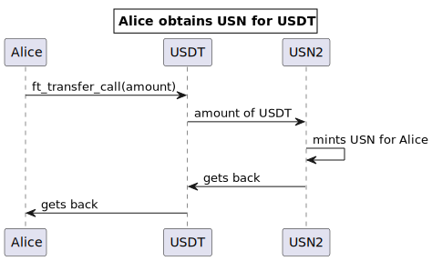
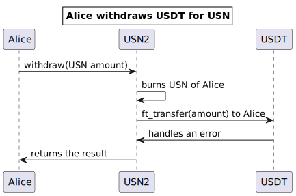

[](https://github.com/decentralbankdao/usn)

# USN

USN is a NEAR-native USD stable coin.

The contract implements fungible token API according to the following standards:

1. [NEP-141](https://nomicon.io/Standards/FungibleToken/Core) (ERC-20 fashioned)
2. [NEP-148](https://nomicon.io/Standards/FungibleToken/Metadata)
3. [Fungible Token Event](https://nomicon.io/Standards/FungibleToken/Event)

# Contract Address

|         |                 |
| ------- | --------------- |
| Mainnet | `usn `          |
| Testnet | `usdn.testnet`  |
| Sandbox | `usn.test.near` |

# How It Works

## Obtain USN for USDT

_Method:_ `ft_transfer_call` (USDT) -> `ft_on_transfer` (USN)



## Withdraw USDT with `withdraw` API

_Method:_ `withdraw` (USN)



# Build

First, install prerequisites:

```bash
npm install
```

Then, build.

For local sandbox:

```bash
npm run build
```

For testnet:

```bash
npm run build:testnet
```

For mainnet:

```bash
npm run build:mainnet
```

**WARNING**: There is a difference in each target about the addresses for cross-contract communication.

### USDT address

|         |                      |
|---------|----------------------|
| Mainnet | `dac17f958d2ee523a2206206994597c13d831ec7.factory.bridge.near` |
| Testnet | `usdt.fakes.testnet` |
| Sandbox | `usdt.test.near`     |

# Test

## Run unit tests

```bash
cargo test
```

## Run integration tests

```bash
npm run build
npm run deploy
npm run test
```

## Manual testing on the Testnet

Build

```bash
npm run build:testnet
```

Deploy

```bash
near deploy --force --wasmFile target/wasm32-unknown-unknown/testnet/usn.wasm --accountId=usdn.testnet --masterAccount=usdn.testnet
```

Init once

```bash
near call usdn.testnet new --args '{"owner_id": "usdn.testnet"}' --accountId=usdn.testnet
```

Add a guardian

```bash
near call usdn.testnet extend_guardians --accountId usdn.testnet --args '{"guardians": ["alice.testnet"]}'
```

Deposit and withdraw

```bash
# Send USDT, mint USN.
near call usdt.fakes.testnet ft_transfer_call --args '{"receiver_id": "usdn.testnet", "amount": "1000000", "msg": ""}' --accountId alice.testnet --amount 0.000000000000000000000001 --gas 100000000000000

# Burn USN, withdraw USDT.
near call usdn.testnet withdraw --args '{"amount": "999500000000000000"}' --accountId alice.testnet --amount 0.000000000000000000000001 --gas 100000000000000
```

# DAO

## Upgrade the contract via Upgrade Proposal

1. Download `usn.mainnet.wasm` from https://github.com/binary-star-near/usn/releases
2. Create an upgrade proposal:
   ```bash
   sputnikdao proposal upgrade usn.mainnet.wasm usn --daoAcc decentralbank --accountId alice.near --network mainnet
   ```

# API

## Deposit/withdraw

```rust
// Deposit
pub fn ft_on_transfer(&mut self, sender_id: AccountId, amount: U128, msg: String) -> PromiseOrValue<U128>;
// Withdraw
pub fn withdraw(&mut self, asset_id: Option<AccountId>, amount: U128) -> Promise;
```

## View methods

```rust
pub fn contract_status(&self) -> ContractStatus;
pub fn name(&self) -> String;
pub fn symbol(&self) -> String;
pub fn decimals(&self) -> u8;
pub fn version(&self) -> String;
pub fn blacklist_status(&self, account_id: &AccountId) -> BlackListStatus;
pub fn owner(&self);
pub fn treasury(&self) -> Vec<(AccountId, StableInfo)>;
pub fn commission(&self) -> CommissionOutput;
```

## NEP-141 (ERC-20)

```rust
pub fn ft_transfer(&mut self, receiver_id: AccountId, amount: U128, memo: Option<String>);
pub fn ft_transfer_call(
        &mut self,
        receiver_id: AccountId,
        amount: U128,
        memo: Option<String>,
        msg: String,
    ) -> PromiseOrValue<U128>;
pub fn ft_total_supply(&self) -> U128;
pub fn ft_balance_of(&self, account_id: AccountId) -> U128;
pub fn ft_metadata(&self) -> FungibleTokenMetadata;
pub fn ft_on_transfer(&mut self, sender_id: AccountId, amount: U128, msg: String) -> PromiseOrValue<U128>;
```

## NEP-145: partial storage API

Always returns 125 milliNEAR indicating that user doesn't need to be registered
with `storage_deposit`.

```rust
pub fn storage_balance_of(&self, account_id: AccountId) -> Option<StorageBalance>;
```

## Constructor

```rust
pub fn new(owner_id: AccountId) -> Self;
```

## Private setters

For owner only.

```rust
pub fn upgrade_name_symbol(&mut self, name: String, symbol: String);
pub fn upgrade_icon(&mut self, data: String);
pub fn add_to_blacklist(&mut self, account_id: &AccountId);
pub fn remove_from_blacklist(&mut self, account_id: &AccountId);
pub fn destroy_black_funds(&mut self, account_id: &AccountId);
pub fn pause(&mut self);
pub fn resume(&mut self);
pub fn set_owner(&mut self, owner_id: AccountId);
pub fn extend_guardians(&mut self, guardians: Vec<AccountId>);
pub fn remove_guardians(&mut self, guardians: Vec<AccountId>);
pub fn add_stable_asset(&mut self, asset_id: &AccountId, decimals: u8);
pub fn enable_stable_asset(&mut self, asset_id: &AccountId);
pub fn disable_stable_asset(&mut self, asset_id: &AccountId);
```

## Upgradability

```rust
pub fn upgrade();
pub fn migrate() -> Self;
```
