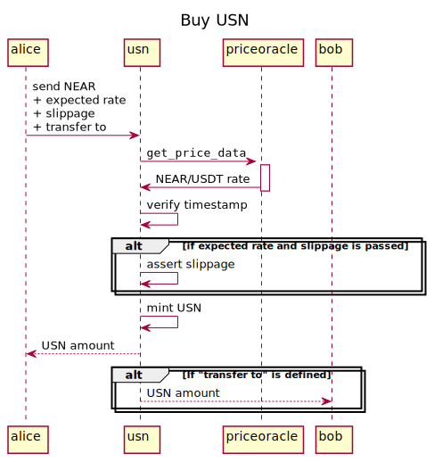
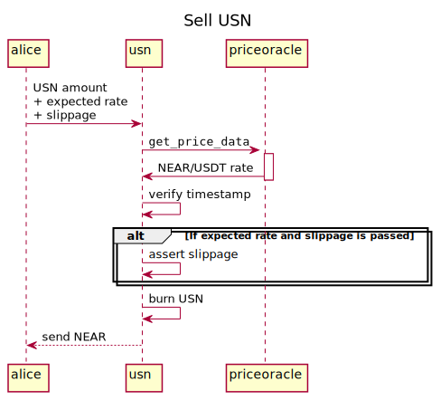

[](https://github.com/decentralbankdao/usn)

# USN

USN is a NEAR-native USD stable coin.

The contract implements fungible token API according to the following standards:

1. [NEP-141](https://nomicon.io/Standards/FungibleToken/Core) (ERC-20 fashioned)
2. [NEP-148](https://nomicon.io/Standards/FungibleToken/Metadata)
3. [Fungible Token Event](https://nomicon.io/Standards/FungibleToken/Event)

The specific part of the USN contract is `buy`/`sell` methods of NEAR/USD exchange with rates taken from the oracle ([priceoracle](https://github.com/NearDeFi/price-oracle/)).

# Contract Address

| Mainnet | Testnet      |
| ------- | ------------ |
| usn     | usdn.testnet |

# How It Works

## Buy USN for NEAR

_Method:_ `buy`



## Sell USN for NEAR with `sell` API

_Method:_ `sell`



## Slippage

Methods `buy` and `sell` requires the _expected_ exchange rate to avoid slippage. If the price suddenly changes (slips) out of the expected deviation the USN contract aborts the transaction.

# Build

First, install prerequisites:

```bash
npm install
```

Then, build.

For local sandbox:

```bash
npm run build
```

For testnet:

```bash
npm run build:testnet
```

For mainnet:

```bash
npm run build:mainnet
```

**WARNING**: There is a difference in each target. The crucial difference is that they communicate with different oracle addresses:

- Mainnet: `priceoracle.near`
- Testnet: `priceoracle.testnet`
- Sandbox: `priceoracle.test.near`

And all these oracle contracts report prices with different asset names.

# Test

## Run unit tests

```bash
cargo test
```

## Run integration tests

```bash
npm run build
npm run deploy
npm run test
```

## Manual testing on the Testnet

Build

```bash
npm run build:testnet
```

Deploy

```bash
near deploy --force --wasmFile target/wasm32-unknown-unknown/testnet/usn.wasm --accountId=usdn.testnet --masterAccount=usdn.testnet
```

Init once

```bash
near call usdn.testnet new --args '{"owner_id": "usdn.testnet"}' --accountId=usdn.testnet
```

Add a guardian

```bash
near call usdn.testnet extend_guardians --accountId usdn.testnet --args '{"guardians": ["alice.testnet"]}'
```

Buy and sell

```bash
# Send NEAR, buy USN.
near call usdn.testnet buy --accountId alice.testnet --amount 1 --gas 50000000000000

# Check USN balance.
near call usdn.testnet ft_balance_of --accountId alice.testnet --args '{"account_id": "alice.testnet"}'

# Sell USN, receive NEAR.
near call usdn.testnet sell --accountId alice.testnet --args '{"amount": "118800"}' --amount 0.000000000000000000000001 --gas 50000000000000

# Buy USN with slippage control
 near call usdn.testnet buy  --args '{"expected": {"multiplier": "111439", "slippage": "10", "decimals": "28" }}' --accountId alice.testnet --amount 1 --gas 50000000000000

# Buy USN and transfer to someone.
near call usdn.testnet buy --args '{"to": "bob.testnet"}' --accountId alice.testnet --amount 1 --gas 50000000000000
```

Predict Buy, Predict Sell
```bash
near view usdn.testnet predict_sell --args '{"amount": "10000000000000000000", "rates": [{"multiplier": "61751", "decimals": 28}, {"multiplier": "61751", "decimals": 28}]}'
# Returns the following JSON:
#
# amount: '1611309938300594322359152', - amount NEAR, the user would recieve if sold USN
# commission: {
#   usn: '50000000000000000',          - commission in USN
#   near: '8097034865832132273161',    - commission in NEAR
# },
# rate: {                              - the rate has been used for exchange
#   "decimals": 28,
#   "multiplier": "61751",
# }

near view usdn.testnet predict_buy --args '{"amount": "10000000000000000000000000", "rates": [{"multiplier": "61751", "decimals": 28}, {"multiplier": "61751", "decimals": 28}]}'
# Returns the following JSON:
#
# amount: '61442368502000000000',     - amount USN, the user would recieve if buy USN
# commission: {
#   usn: '308631498000000000',        - commission in USN
#   near: '49980000000000000000000',  - commission in NEAR
# },
# rate: {                             - the rate has been used for exchange
#   "decimals": 28,
#   "multiplier": "61751",
# }
```

# DAO

## Upgrade the contract via Upgrade Proposal

1. Download `usn.mainnet.wasm` from https://github.com/binary-star-near/usn/releases
2. Create an upgrade proposal:
   ```bash
   sputnikdao proposal upgrade usn.mainnet.wasm usn --daoAcc usn --accountId alice.near --network mainnet
   ```

# API

## Buy/sell USN

Send NEAR, receive USN.

```rust
pub fn buy(&mut self, expected: Option<ExpectedRate>, to: Option<AccountId>);
```

Send USN, receive NEAR.

```rust
pub fn sell(&mut self, amount: U128, expected: Option<ExpectedRate>) -> Promise;
```

## View methods

```rust
pub fn contract_status(&self) -> ContractStatus;
pub fn name(&self) -> String;
pub fn symbol(&self) -> String;
pub fn decimals(&self) -> u8;
pub fn spread(&self, amount: Option<U128>) -> U128;
pub fn version(&self) -> String;
pub fn blacklist_status(&self, account_id: &AccountId) -> BlackListStatus;
pub fn owner(&self);
pub fn commission(&self) -> CommissionOutput;
pub fn predict_sell(&self, account_id: Option<AccountId>, amount: U128, rates: Vec<ExchangeRateValue>) -> ExchangeResultOutput;
pub fn predict_buy(&self, account_id: Option<AccountId>, amount: U128, rates: Vec<ExchangeRateValue>) -> ExchangeResultOutput;
```

## NEP-141 (ERC-20)

```rust
pub fn ft_transfer(&mut self, receiver_id: AccountId, amount: U128, memo: Option<String>);
pub fn ft_transfer_call(
        &mut self,
        receiver_id: AccountId,
        amount: U128,
        memo: Option<String>,
        msg: String,
    ) -> PromiseOrValue<U128>;
pub fn ft_total_supply(&self) -> U128;
pub fn ft_balance_of(&self, account_id: AccountId) -> U128;
pub fn ft_metadata(&self) -> FungibleTokenMetadata;
```

## NEP-145: partial storage API

Always returns 125 milliNEAR indicating that user doesn't need to be registered
with `storage_deposit`.

```rust
pub fn storage_balance_of(&self, account_id: AccountId) -> Option<StorageBalance>;
```

## Constructor

```rust
pub fn new(owner_id: AccountId) -> Self;
```

## Private setters

For owner only.

```rust
pub fn upgrade_name_symbol(&mut self, name: String, symbol: String);
pub fn upgrade_icon(&mut self, data: String);
pub fn add_to_blacklist(&mut self, account_id: &AccountId);
pub fn remove_from_blacklist(&mut self, account_id: &AccountId);
pub fn destroy_black_funds(&mut self, account_id: &AccountId);
pub fn pause(&mut self);
pub fn resume(&mut self);
pub fn set_fixed_spread(&mut self, spread: U128) {
pub fn set_adaptive_spread(&mut self, params: Option<ExponentialSpreadParams>);
pub fn set_owner(&mut self, owner_id: AccountId);
pub fn extend_guardians(&mut self, guardians: Vec<AccountId>);
pub fn remove_guardians(&mut self, guardians: Vec<AccountId>);
```

## Upgradability

```rust
pub fn upgrade();
pub fn migrate() -> Self;
```
